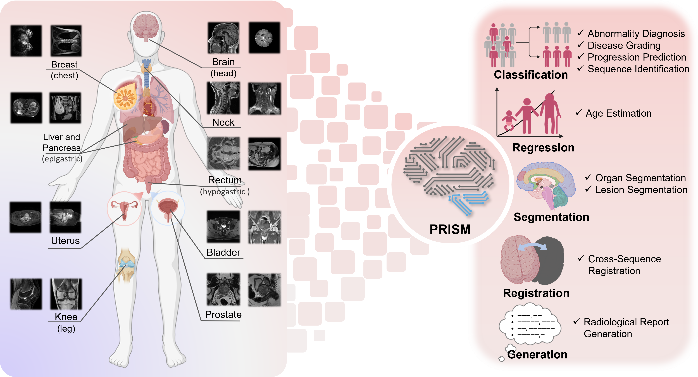
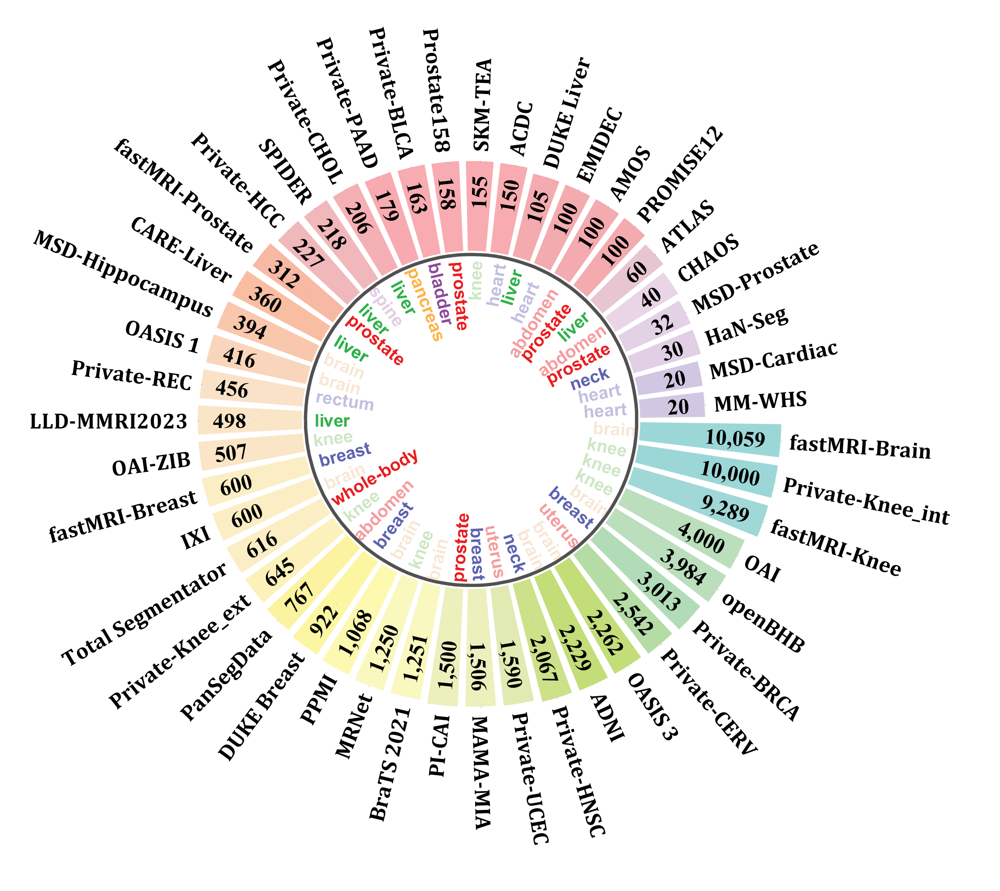

# PRISM: Large-scale Multi-sequence Pretraining for Generalizable MRI Analysis in Versatile Clinical Applications


[]()
[](https://opensource.org/licenses/Apache-2.0)
[]()
[](https://monai.io/)

## Introduction
This is public repository of **PRISM**, a foundation model **PR**e-trained with large-scale mult**I**-**S**equence **M**RI. We collected a total of 64 datasets from both public and private sources, encompassing a wide range of whole-body anatomical structures, with scans spanning diverse MRI sequences.
We pre-trained a 3D Swin Transformer on the dataset with 336,476 multi-sequence MRI volumes (PRISM-336k) collected from 8 public repositories and 26 in-house database, covering 10 anatomical regions and various imaging protocols.



<!--  -->

## Getting Started

### Installation
First, copy this repository and install the required packages. You can do this by running the following command:
```bash
git clone https://github.com/zqiuak/PRISM.git
cd main
pip install -r requirements.txt
```


### Preparation your dataset
You can download the [example dataset](https://www.kaggle.com/datasets/anhoangvo/acdc-dataset) to test the codes.

For validation on your own dataset, be sure to follow the instructions in the `dataset/README.md` file and go to section [Fine-tuning](#fine-tuning).
We have provided some examples of how to prepare your datasets.
Change the dataset path in the `run/options.py` file to fit your dataset.
A simple example of dataset path configuration is shown below:
```
class Data_Path_Class():
    def __init__(self):
        self.root = "./database/"  # Root directory for dataset
        self.datapath = self.root  # image data subdirectories are here
        self.labelfilepath = os.path.join(self.root, "labels/")  # Directory for label files"
        self.cache_dir = os.path.join(self.root, "cache/") # Directory for cache files
data_path = Data_Path_Class()
```

### Download the Pre-trained Weights
You can download the [pre-trained weights of PRISM](https://drive.google.com/file/d/1__lWJfBaCSQqkyPvxpQqK-MWH_d__bWz/view?usp=sharing), and place the downloaded file in the `main/weights` folder of this repository.

## Training
### Fine-tuning
Once set up the dataset and downloaded the pre-trained weights, you can fine-tune the model on your own dataset.

For classification, segmentation and regression tasks, modify the `run_ft.sh` file to set your task and weight name, and then run the script:

```task```: the name of your task, also be the name of the dataset folder in the `dataset` directory.

```weight_name```: the name of the pre-trained weight file without the `.pt` extension, if file does not exist, it will run the training from scratch.

```bash
bash run_ft.sh
```

For registration, the evaluation process uses [TransMorph](https://github.com/junyuchen245/TransMorph_Transformer_for_Medical_Image_Registration). 
Please refer to the repository for [IXI](https://github.com/junyuchen245/TransMorph_Transformer_for_Medical_Image_Registration/tree/main/IXI) and [OASIS](https://github.com/junyuchen245/TransMorph_Transformer_for_Medical_Image_Registration/tree/main/OASIS).

For report generation, the evaluation process uses [R2GenGPT](https://github.com/wang-zhanyu/R2GenGPT).


Finetuning time differs depending on the hardware (GPU) used.
### Pre-training
If you want to pre-train the model on your own dataset, you can run the following command:
```bash
bash run_pt.sh
```

### Load Pre-trained weight on your own models:
If you want to load the pre-trained weights of PRISM on your own models, you can use the following code snippet. 
In this example, your model should have an object of `monai.networks.nets.swin_unetr.SwinTransformer`, with the attribute `model_vit_key` set to the same value as the key used in the pre-trained weights (usually `swinViT` for Swin Transformer).

```python
import torch

def load_pt(model, weight_file, model_vit_key='swinViT'):
  ckpt = torch.load(weight_file, map_location="cpu", weights_only=False)
  if 'state_dict' in ckpt:
      weight = ckpt['state_dict']
  else:
      weight = ckpt
  selected_weight = weight
  current_model_dict = model.state_dict()
  new_model_dict = {}
  for k in current_model_dict.keys():

      if model_vit_key in k: 
          weight_key_suffix = model_vit_key + k.split(model_vit_key)[-1] 

          if weight_key_suffix in selected_weight.keys():
              if (current_model_dict[k].size() == selected_weight[weight_key_suffix].size()):
                  new_model_dict[k] = selected_weight[weight_key_suffix].clone()  
              else:
                  try:
                      new_model_dict[k] = selected_weight[weight_key_suffix].expand_as(current_model_dict[k]).clone()
                      print('[INFO] weight size mismatch:', k, "current size:", current_model_dict[k].size(), "pt size:", selected_weight[weight_key_suffix].size(), "expanded to match current model size")
                  except RuntimeError as e:
                      print('[WARNING] error weight size:', k, "current size:", current_model_dict[k].size(), "pt size:", selected_weight[weight_key_suffix].size(), "expand size error:", e)
                      new_model_dict[k] = current_model_dict[k].clone()
          else:
              print('current model weight:', k, "not found in pretrained weight")
              new_model_dict[k] = current_model_dict[k].clone()
              

      else:
          new_model_dict[k] = current_model_dict[k].clone()

  model.load_state_dict(new_model_dict, strict=True)
  return model

model = load_pt(model, pretrained_weight, ckpt_vit_key='swinViT', model_vit_key='swinViT')
```

<!-- ### Registration


### Report Generation -->


## Acknowledgements
We would like to thank the authors of the following repositories for their contributions to this project:
- [nnU-Net](https://github.com/MIC-DKFZ/nnUNet/tree/master)
- [SwinUNETR: Self-Supervised Pre-Training of Swin Transformers for 3D Medical Image Analysis](https://github.com/Project-MONAI/research-contributions/tree/main/SwinUNETR/Pretrain)
- [BrainSegFounder: Towards Brain Foundation Models for Neuroimage Analysis](https://github.com/lab-smile/BrainSegFounder/tree/main)
- [VoCo: A Simple-yet-Effective Volume Contrastive Learning Framework for 3D Medical Image Analysis](https://github.com/Luffy03/Large-Scale-Medical)
- [TransMorph: Transformer for Unsupervised Medical Image Registration](https://github.com/junyuchen245/TransMorph_Transformer_for_Medical_Image_Registration/tree/main)
- [R2GenGPT: Radiology Report Generation with Frozen LLMs](https://github.com/wang-zhanyu/R2GenGPT)